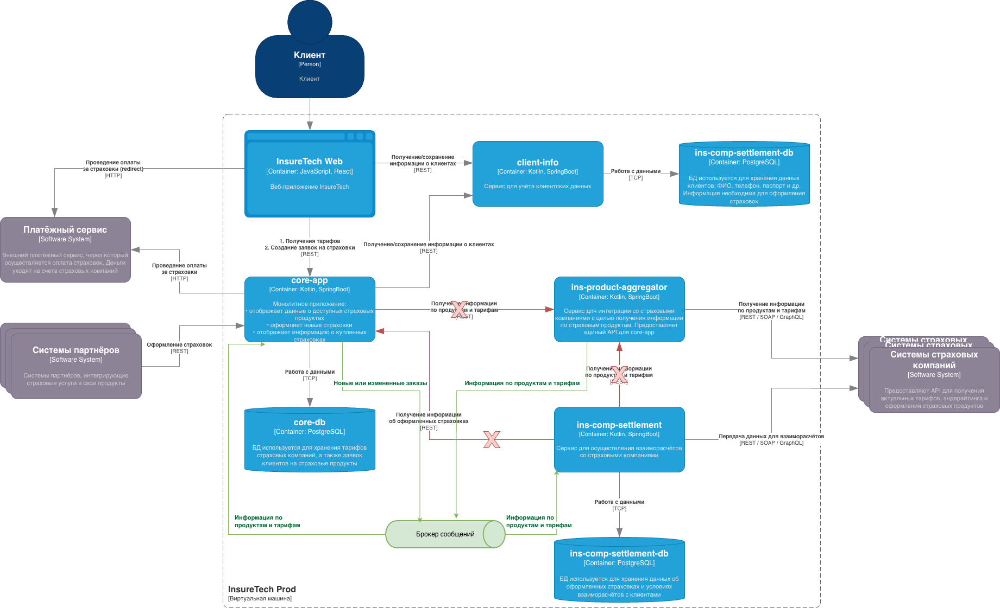

## Анализ текущей архитектуры
### Проблемы: 
- длительные синхронные взаимодействия, которые проходят сразу через несколько компонентов системы
- зависимость от стабильности систем страховых компаний
- риск потери финансовых данных или отчетов при недоступности систем страховых компаний
- выборка оформленных за сутки заказов не должна быть слишком большой, но в то же время, нет преимуществ в регулярных вызовах endpoint-а  
core-app для получения списка оформленных страховок. Создают дополнительную и излишнюю нагрузку на сеть
- часть заказов может быть не учтена в случае недоступности системы страховой компании без возможности восстановления

### Решение:
- необходимо добавить в систему брокер сообщений 
- ins-product-aggregator по-прежнему будет взаимодействовать с системами страховых компаний. Он будет опрашивать системы  
с той же частотой (раз в 15 минут), но будет кидать сообщение в топик с текущей и актуальной информацией по тарифам и  
страховым продуктам 
- альтернатива предыдущему пункту: системы страховых компаний сами скидывают сообщение в топик сообщений только в случае  
произошедших изменений. Необходимо больше security настроек и ограничений для доступа к брокеру и согласие всех страховых 
- core-app и ins-comp-settlement будут считывать сообщений из топика и обновлять свой кеш в случае изменений
- необходимо убрать call от core-app к ins-product-aggregator, тк вся информация будет поступать через брокер 
- необходимо убрать call от ins-comp-settlement  к ins-product-aggregator, тк вся информация будет поступать через брокер 
- core-app будет скидывать сообщение в топик со всей необходимой информацией по новому или обновленному заказу
- ins-comp-settlement будет считывать сообщения от core-app и добавлять необходимую для расчетов информацию в свой кеш
- необходимо убрать запрос от ins-comp-settlement к core-app. Список заказов для регулярного расчета будет браться из  
своей бд
- ins-comp-settlement будет отмечать записи в своей бд, которые уже были учтены в расчетах или не были. Это позволит  
учесть заказ в расчете позже при необходимости 
- необходимо использовать Transactional outbox паттерн на core-app для надежной отправки сообщения в брокер (влияет на  
заработок агрегатора). А также потому, что отправка сообщения не должна влиять на создание или изменение заказа пользователем

### Диаграмма
Красным обозначены связи, которые необходимо удалить
Зеленым обозначены объекты и связи, которые нужно добавить 
