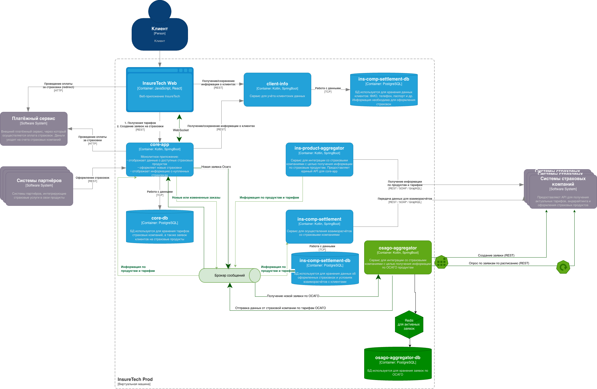

## Решение для обработки заявок по ОСАГО
1. osago-aggregator-у необходима своя схема в существующей бд. Она необходима, что сохранять все приходящие заявки,  
следить за SLA заявки и отправлять по ним запросы в страховые компании, чтобы узнать о готовности результата.
2. Имеет смысл добавить кеш для актуальных записей, по которым в данный момент проводится опрос страховых.  
Альтернативный вариант: удалять из бд записи, у которых вышло время ожидания или получены все ответы. 
3. core-app взаимодействует с osage-aggregator через брокера сообщений. Когда пользователь создает на ui заявку с данными  
об автомобиле, соответствующее сообщение падает в топик, сообщение считывается osago-aggregator-ом.  
В результате обработки сообщения о новой заявке, создается запись в бд и статусом "новый" или "ждет отправки".  
Заполняется время, от которого будет отсчитываться время для опроса страховых.  
Scheduler_1 собирает все новые заявки, обновляет статус и отправляет в страховые. 
Scheduler_2 осуществляет опрос страховых api раз в 5 секунд ориентируясь на время последнего опроса и статуса заявки.   
Как только ответ от страховой получен, соответсвующее сообщение отправляется в очередь. Не нужно ждать ответа от всех страховых.  
Если ответа в 60 секунд не было получено, информация вносится в бд и отправляется сообщение.
4. Из-за достаточно большого количества одновременных пользователей, pulling из ui в api будет нагружать систему core-app.  
Поэтому лучше настроить взаимодействие ui <--> api с помощью WebSocket. Ответы будут поступать от страховых по одному.  
WebSocket можно настроить при нескольких инстансах api, необходимы дополнительные настройки в load balancer. 
5. При взаимодействии с сервисами страховых компаний имеет смысл настроить retry, а также rate limiting, если есть  
определенные договоренности о количестве запросов. 
6. Взаимодействие с очередями и статусами записей в бд позволит горизонтально масштабировать необходимые участки флоу.

